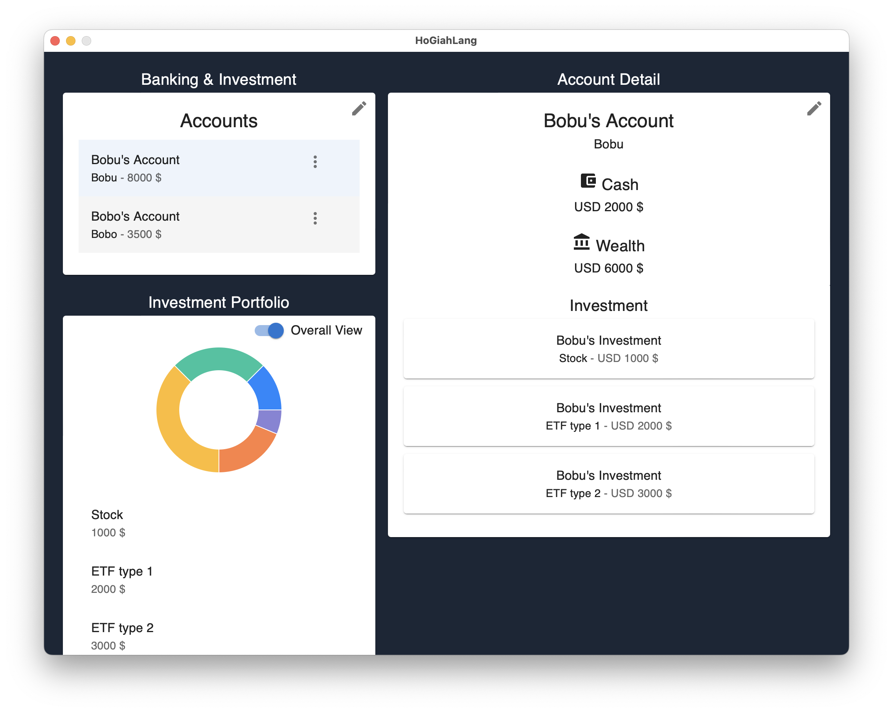

# 🔧 Work in progress
# HoGiahLang: The Accounting App

This is a minimal accounting desktop application built with [Wails](https://wails.io/).
The application allows users to save and have an overview of their asset distributions.

Aim to provide a simple accounting application that can be used to track assets and liabilities. Ultimately, help everyone to become **hó-gia̍h-lâng**, Taiwanese for rich people 💰.

## Features

- Input and save total assets.
- Persist data using SQLite.
- Cross-platform desktop application.

## Getting Started

### Prerequisites

Before you start, make sure you have the following installed on your system:

- [Go](https://golang.org/dl/) (version 1.19+)
- [Node.js](https://nodejs.org/) (version 14+)
- [Wails CLI](https://wails.io/)

### Installation

1. **Clone the repository:**

   ```bash
   git clone https://github.com/yourusername/SimpleAccountingApp.git
   cd SimpleAccountingApp
   ```

2. **Install Go dependencies:**

   ```bash
   go mod tidy
   ```

3. **Install Node.js dependencies:**

   ```bash
   cd frontend
   npm install
   cd ..
   ```

4. **Run the application in development mode:**

   ```bash
   wails dev
   ```

   This will start the development server, and the application will open in a window.

### Building the Application

To build the application for your operating system:

```bash
wails build
```
This command will generate the executable in the `build/bin` directory.

### Testing the Application

To run the tests:

```bash
go test ./<package name in backend>
```

## Release of the software

The release of the software is automated using the GitHub Actions. The release is triggered when a new tag is pushed to the repository. The release will create a new release with the binaries for MacOS universal architechture.

### Versioning

**Semantic versioning** is used for versioning the software. The [action pipeline](.github/workflows/semantic_versioning.yml) will create a new release by incrementing the version number based on the commit messages and tag the repo with calculated version.

## Project Structure

- **internal/**: Contains the Go backend code for database interactions.
  - **app/**
    - `os.go`: OS-specific functions.
    - `processing.go`: Functions for processing data.
  - **db/**
    - `database.go`: SQLite database setup and operations.
    - `database_test.go`: Tests for the database operations.
    - `utilites.go`: Utility functions for database operations.
- **frontend/**: Contains the React frontend code.
  - **src/**
    - **components/**: React components.
    - **pages/**: React pages.
  - `main.tsx`: Entry point for the React application.
- `main.go`: Application entry point and Wails bindings.
- **build/**: Output directory for the built application.
- **wails.json**: Wails project configuration.

## Techstack

- [Wails](https://wails.io/): A framework for building desktop applications using Go and Web technologies.
- [TypeScript](https://www.typescriptlang.org/): A typed superset of JavaScript that compiles to plain JavaScript.
- [React](https://reactjs.org/): A JavaScript library for building user interfaces.
- [SQLite](https://sqlite.org/index.html): A lightweight database engine.
- [Go](https://golang.org/): A statically typed, compiled programming language.

## Screenshots



## Contributing

If you'd like to contribute to this project, please fork the repository and use a feature branch. Pull requests are welcome!

## License

This project is licensed under the MIT License. See the [LICENSE](LICENSE) file for more details.

## Acknowledgments

- [Wails](https://wails.io/) for providing the framework to build cross-platform desktop applications.
- [React](https://reactjs.org/) and [TypeScript](https://www.typescriptlang.org/) for the frontend.
- [SQLite](https://sqlite.org/index.html) for the lightweight database.
